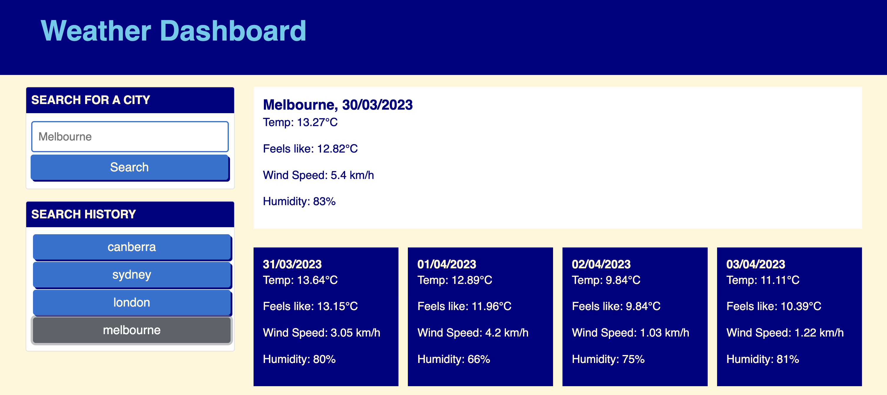

## Project Title

Isabel's Weather Dashboard

## Project Description

The Weather Dashboard connect with OpenWeather API to provide a 5-day forecast for a given city. Past searches will be saved to local storage, and displayed in buttons below the search history heading. 

## Mock-Up

The following image shows the web application's appearance and functionality:

## Installation & Links

Deployed Application: [isabelkvaughan.github.io/weather-dashboard](https://isabelkvaughan.github.io/weather-dashboard/)

GitHub Repository: [github.com/isabelkvaughan/weather-dashboard](https://github.com/isabelkvaughan/weather-dashboard)

GitHub profile: [github.com/isabelkvaughan](https://github.com/isabelkvaughan)

## Contact

Isabel Vaughan 
https://www.linkedin.com/in/isabel-vaughan-b68984bb/